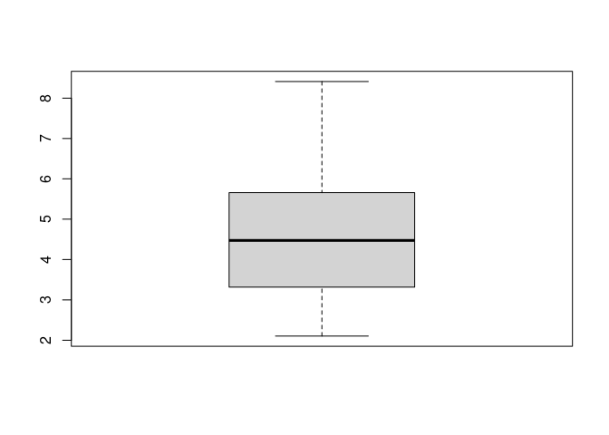
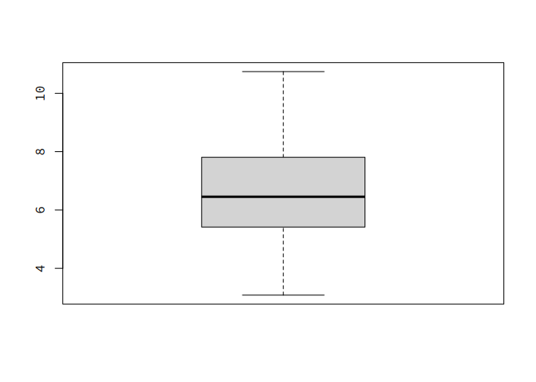
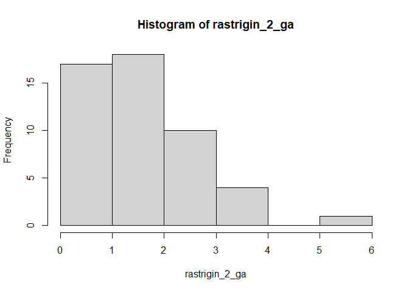
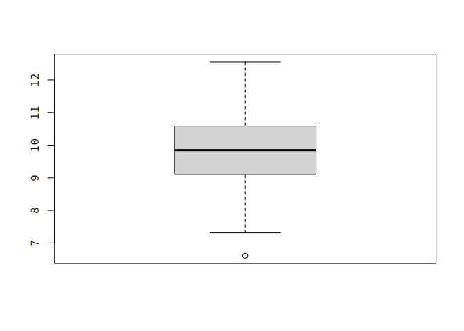

# Porównanie algorytmów PRS i GA

Autorzy: Krzysztof Dziechciarz, Dominik Pilipczuk

### Potrzebne biblioteki:

    library(GA)
    library(smoof)

### Definicje funkcji:

`calculate_prs` - zwraca liste najmniejszych wartości znalezionych przez
algorytm PRS (dla `iters` wywołań)

    calculate_prs <- function(fitness, iters) {
        lower <- getLowerBoxConstraints(fitness)
        upper <- getUpperBoxConstraints(fitness)
        dimensions <- length(lower)

        single_prs <- function() {
            min_value <- Inf
            random_vector <- numeric(dimensions)
            for (i in 1:1000) {
                for (j in 1:dimensions) {
                    random_vector[j] <- runif(1, min = lower[j], max = upper[j])
                }
                min_value <- min(min_value, fitness(random_vector))
            }

            return(min_value)
        }

        return(replicate(iters, single_prs()))
    }

`calculate_prs` - zwraca liste najmniejszych wartości znalezionych przez
algorytm GA (dla `iters` wywołań)

    calculate_ga <- function(fitness, iters) {
        lower <- getLowerBoxConstraints(fitness)
        upper <- getUpperBoxConstraints(fitness)

        single <- function() {
            current_ga <- ga(
                type = "real-valued",
                fitness = function(x) (-1) * fitness(x),
                lower = lower,
                upper = upper,
                popSize = 50,
                maxiter = 20
            )

            return(fitness(current_ga@solution))
        }

        return(replicate(iters, single()))
    }

------------------------------------------------------------------------

# Porównanie

## Dla dwóch wymiarów

    ackley_2 <- makeAckleyFunction(2)
    ackley_2_ga <- calculate_ga(ackley_2, 50)
    ackley_2_prs <- calculate_prs(ackley_2, 50)

### GA

Średnia wartość:

    ## [1] 0.2322054

Wykres pudełkowy:

### PRS

Średnia wartość:

    ## [1] 3.613832

Wykres pudełkowy:

### Head to head

Różnica średnich wyników:

    ## [1] 3.381626

## Dla dziesięciu wymiarów

    ackley_10 <- makeAckleyFunction(10)
    ackley_10_ga <- calculate_ga(ackley_10, 50)
    ackley_10_prs <- calculate_prs(ackley_10, 50)

### GA

Średnia wartość:

    ## [1] 6.615361

Wykres pudełkowy:

### PRS

Średnia wartość:

    ## [1] 18.11387

Wykres pudełkowy:

### Head to head

Różnica średnich wyników:

    ## [1] 11.49851

## Dla dwudziestu wymiarów

    ackley_20 <- makeAckleyFunction(20)
    ackley_20_ga <- calculate_ga(ackley_20, 50)
    ackley_20_prs <- calculate_prs(ackley_20, 50)

### GA

Średnia wartość:

    ## [1] 9.788317

Wykres pudełkowy:

### PRS

Średnia wartość:

    ## [1] 19.78771

Wykres pudełkowy:

### Head to head

Różnica średnich wyników:

    ## [1] 9.999394
