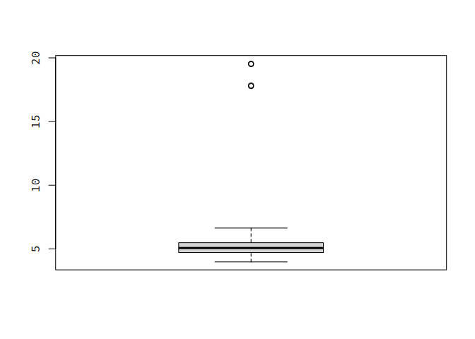
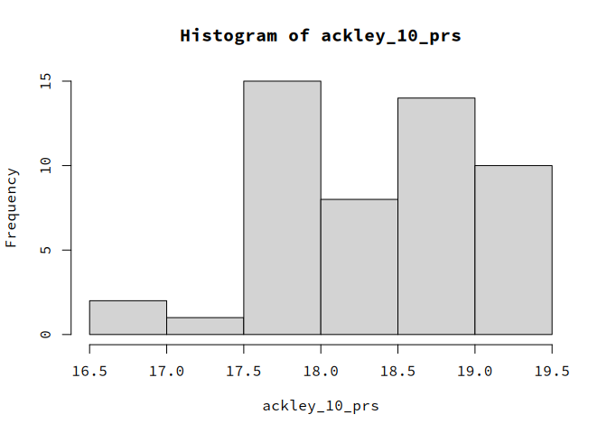
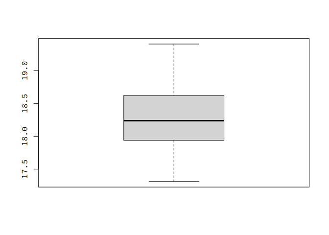
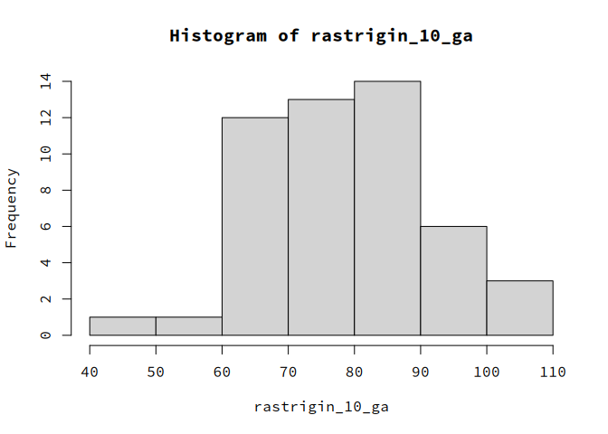
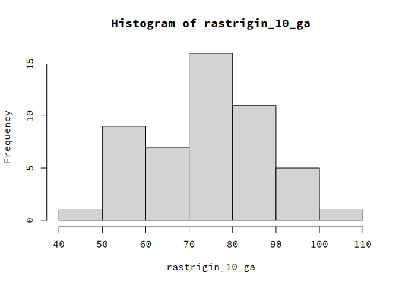
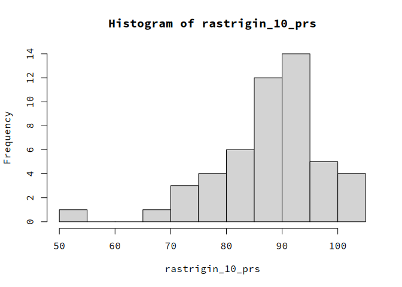
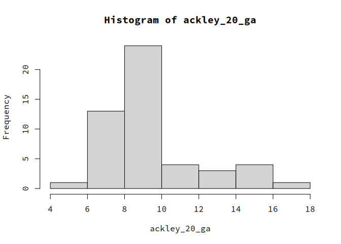
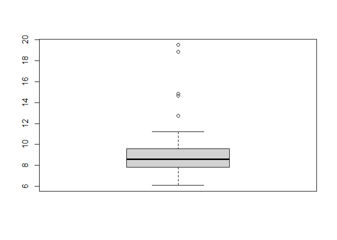
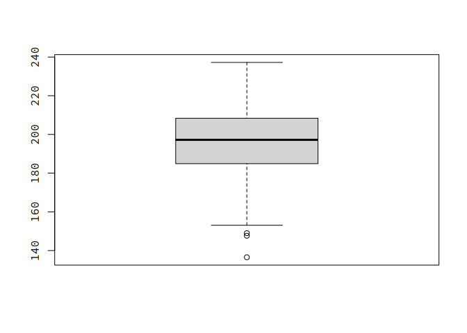
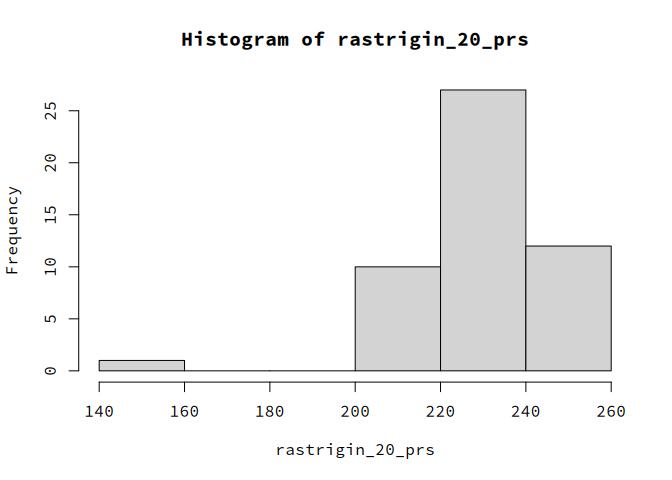

# Porównanie algorytmów PRS i GA

Autorzy: Krzysztof Dziechciarz, Dominik Pilipczuk

### Potrzebne biblioteki:

    library(ecr)
    library(smoof)
    library(mcreplicate)

### Definicje funkcji:

`calculate_prs` - zwraca liste najmniejszych wartości znalezionych przez
algorytm PRS (dla `iters` wywołań)

    calculate_prs <- function(fitness, iters) {
        lower <- getLowerBoxConstraints(fitness)
        upper <- getUpperBoxConstraints(fitness)
        dimensions <- length(lower)

        single_prs <- function() {
            min_value <- Inf
            random_vector <- numeric(dimensions)
            for (i in 1:1000) {
                for (j in 1:dimensions) {
                    random_vector[j] <- runif(1, min = lower[j], max = upper[j])
                }
                min_value <- min(min_value, fitness(random_vector))
            }

            return(min_value)
        }

        return(replicate(iters, single_prs()))
    }

`calculate_ga` - zwraca liste najmniejszych wartości znalezionych przez
algorytm GA (dla `iters` wywołań)

    calculate_ga <- function(fitness, iters) {
        lower <- getLowerBoxConstraints(fitness)
        upper <- getUpperBoxConstraints(fitness)
        dims <- getNumberOfParameters(fitness)

        single_ga <- function() {
            res <- ecr(
                fitness.fun = fitness, representation = "float",
                n.dim = dims,
                mu = 10L, lambda = 1L,
                mutator = setup(mutGauss, sdev = 2, lower = lower, upper = upper),
                terminators = list(stopOnIters(1000))
            )

            return(res$best.y)
        }

        return(mc_replicate(iters, single_ga()))
    }

------------------------------------------------------------------------

# Porównanie

## Dla dwóch wymiarów - Funkcja Ackley’a

    ackley_2 <- makeAckleyFunction(2)
    ackley_2_ga <- calculate_ga(ackley_2, 50)

    ackley_2_prs <- calculate_prs(ackley_2, 50)

### GA

Histogram:

Wykres pudełkowy:

Podsumowanie:

    summary(ackley_2_ga)

    ##    Min. 1st Qu.  Median    Mean 3rd Qu.    Max. 
    ## 0.04226 0.24917 0.48617 0.64572 1.05818 2.32429

Średnia wartość:

    ## [1] 0.6457218

### PRS

Histogram:

Wykres pudełkowy:

Podsumowanie:

    summary(ackley_2_prs)

    ##    Min. 1st Qu.  Median    Mean 3rd Qu.    Max. 
    ##   2.471   3.220   4.271   4.183   4.870   6.665

Średnia wartość:

    ## [1] 4.182729

## Dla dwóch wymiarów - Funkcja Rastrigina

    rastrigin_2 <- makeRastriginFunction(2)
    rastrigin_2_ga <- calculate_ga(rastrigin_2, 50)

    rastrigin_2_prs <- calculate_prs(rastrigin_2, 50)

### GA

Histogram:

Wykres pudełkowy:

Podsumowanie:

    summary(rastrigin_2_ga)

    ##    Min. 1st Qu.  Median    Mean 3rd Qu.    Max. 
    ## 0.03901 0.99834 1.29663 1.51375 2.22478 4.47149

Średnia wartość:

    ## [1] 1.513747

### PRS

Histogram:

Wykres pudełkowy:

Podsumowanie:

    summary(rastrigin_2_prs)

    ##    Min. 1st Qu.  Median    Mean 3rd Qu.    Max. 
    ## 0.01156 1.31749 2.02479 1.95775 2.51225 4.06667

Średnia wartość:

    ## [1] 1.957755

## Dla dziesięciu wymiarów - Funkcja Ackley’a

    ackley_10 <- makeAckleyFunction(10)
    ackley_10_ga <- calculate_ga(ackley_10, 50)

    ackley_10_prs <- calculate_prs(ackley_10, 50)

### GA

Histogram:

Wykres pudełkowy:

Podsumowanie:

    summary(ackley_10_ga)

    ##    Min. 1st Qu.  Median    Mean 3rd Qu.    Max. 
    ##   3.973   4.713   5.064   6.162   5.482  19.557

Średnia wartość:

    ## [1] 6.162155

### PRS

Histogram:

Wykres pudełkowy:

Podsumowanie:

    summary(ackley_10_prs)

    ##    Min. 1st Qu.  Median    Mean 3rd Qu.    Max. 
    ##   16.72   17.75   18.46   18.31   18.78   19.37

Średnia wartość:

    ## [1] 18.31244

## Dla dziesięciu wymiarów - Funkcja Rastringa

    rastrigin_10 <- makeRastriginFunction(10)
    rastrigin_10_ga <- calculate_ga(rastrigin_10, 50)

    rastrigin_10_prs <- calculate_prs(rastrigin_10, 50)

### GA

Histogram:

Wykres pudełkowy:

Podsumowanie:

    summary(rastrigin_10_ga)

    ##    Min. 1st Qu.  Median    Mean 3rd Qu.    Max. 
    ##   42.44   68.41   78.28   78.15   86.35  107.14

Średnia wartość:

    ## [1] 78.14743

### PRS

Histogram:

Wykres pudełkowy:

Podsumowanie:

    summary(rastrigin_10_prs)

    ##    Min. 1st Qu.  Median    Mean 3rd Qu.    Max. 
    ##   57.61   76.59   85.34   84.24   92.32  103.26

Średnia wartość:

    ## [1] 84.23634

## Dla dwudziestu wymiarów - Funkcja Ackley’a

    ackley_20 <- makeAckleyFunction(20)
    ackley_20_ga <- calculate_ga(ackley_20, 50)

    ackley_20_prs <- calculate_prs(ackley_20, 50)

### GA

Histogram:

Wykres pudełkowy:

Podsumowanie:

    summary(ackley_20_ga)

    ##    Min. 1st Qu.  Median    Mean 3rd Qu.    Max. 
    ##   5.795   7.802   8.493   9.441   9.791  17.939

Średnia wartość:

    ## [1] 9.440547

### PRS

Histogram:

Wykres pudełkowy:

Podsumowanie:

    summary(ackley_20_prs)

    ##    Min. 1st Qu.  Median    Mean 3rd Qu.    Max. 
    ##   18.52   19.82   19.98   19.90   20.11   20.40

Średnia wartość:

    ## [1] 19.90343

## Dla dwudziestu wymiarów - Funkcja Rastringa

    rastrigin_20 <- makeRastriginFunction(20)
    rastrigin_20_ga <- calculate_ga(rastrigin_20, 50)

    rastrigin_20_prs <- calculate_prs(rastrigin_20, 50)

### GA

Histogram:

Wykres pudełkowy:

Podsumowanie:

    summary(rastrigin_20_ga)

    ##    Min. 1st Qu.  Median    Mean 3rd Qu.    Max. 
    ##   135.7   177.4   197.1   194.6   209.6   247.2

Średnia wartość:

    ## [1] 194.6455

### PRS

Histogram:

Wykres pudełkowy:

Podsumowanie:

    summary(rastrigin_20_prs)

    ##    Min. 1st Qu.  Median    Mean 3rd Qu.    Max. 
    ##   179.8   223.2   231.3   230.3   239.6   253.4

Średnia wartość:

    ## [1] 230.2534
