# Porównanie algorytmów PRS i GA

Autorzy: Krzysztof Dziechciarz, Dominik Pilipczuk

### Potrzebne biblioteki:

    library(ecr)
    library(smoof)
    library(mcreplicate)

### Definicje funkcji:

`calculate_prs` - zwraca liste najmniejszych wartości znalezionych przez
algorytm PRS (dla `iters` wywołań)

    calculate_prs <- function(fitness, iters) {
        lower <- getLowerBoxConstraints(fitness)
        upper <- getUpperBoxConstraints(fitness)
        dimensions <- length(lower)

        single_prs <- function() {
            min_value <- Inf
            random_vector <- numeric(dimensions)
            for (i in 1:1000) {
                for (j in 1:dimensions) {
                    random_vector[j] <- runif(1, min = lower[j], max = upper[j])
                }
                min_value <- min(min_value, fitness(random_vector))
            }

            return(min_value)
        }

        return(replicate(iters, single_prs()))
    }

`calculate_prs` - zwraca liste najmniejszych wartości znalezionych przez
algorytm GA (dla `iters` wywołań)

    calculate_ga <- function(fitness, iters) {
        lower <- getLowerBoxConstraints(fitness)
        upper <- getUpperBoxConstraints(fitness)
        dims <- getNumberOfParameters(fitness)

        single_ga <- function() {
            res <- ecr(
                fitness.fun = fitness, representation = "float",
                n.dim = dims,
                mu = 10L, lambda = 1L,
                mutator = setup(mutGauss, sdev = 2, lower = lower, upper = upper),
                terminators = list(stopOnIters(1000))
            )

            return(res$best.y)
        }

        return(replicate(iters, single_ga()))
    }

------------------------------------------------------------------------

# Porównanie

## Dla dwóch wymiarów - Funkcja Ackley’a

    ackley_2 <- makeAckleyFunction(2)
    ackley_2_ga <- calculate_ga(ackley_2, 50)
    ackley_2_prs <- calculate_prs(ackley_2, 50)

### GA

Histogram:

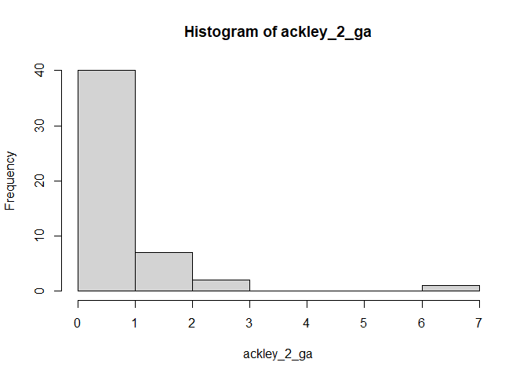

Wykres pudełkowy:

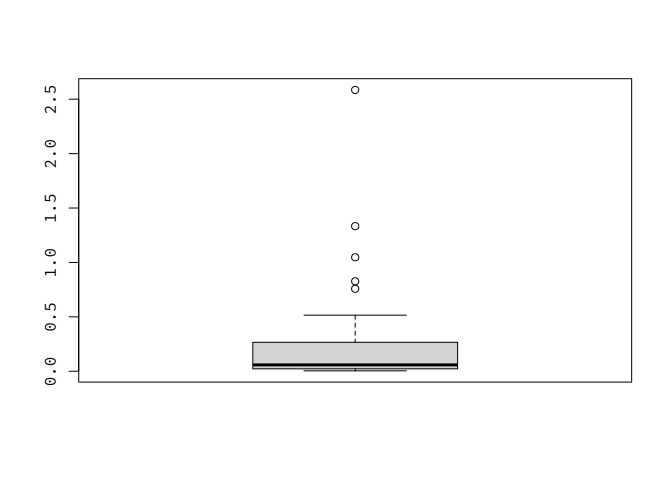

Podsumowanie:

    summary(ackley_2_ga)

    ##     Min.  1st Qu.   Median     Mean  3rd Qu.     Max. 
    ## 0.001128 0.144766 0.325575 0.480656 0.768509 1.585099

Średnia wartość:

    ## [1] 0.4806562

### PRS

Histogram:

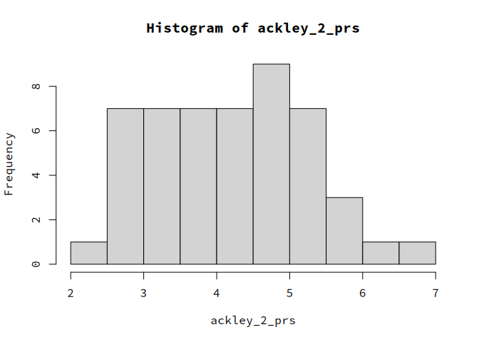

Wykres pudełkowy:

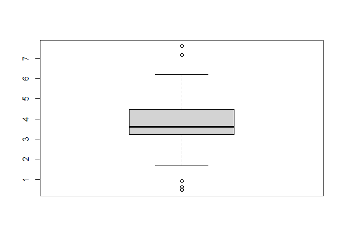

Podsumowanie:

    summary(ackley_2_prs)

    ##    Min. 1st Qu.  Median    Mean 3rd Qu.    Max. 
    ##  0.4767  3.2389  3.6098  3.8307  4.4809  7.6153

Średnia wartość:

    ## [1] 3.830747

### Test t-Studenta

    t.test(ackley_2_ga, ackley_2_prs)

    ## 
    ##  Welch Two Sample t-test
    ## 
    ## data:  ackley_2_ga and ackley_2_prs
    ## t = -15.241, df = 57.419, p-value < 2.2e-16
    ## alternative hypothesis: true difference in means is not equal to 0
    ## 95 percent confidence interval:
    ##  -3.790177 -2.910004
    ## sample estimates:
    ## mean of x mean of y 
    ## 0.4806562 3.8307469

## Dla dwóch wymiarów - Funkcja Rastrigina

    rastrigin_2 <- makeRastriginFunction(2)
    rastrigin_2_ga <- calculate_ga(rastrigin_2, 50)
    rastrigin_2_prs <- calculate_prs(rastrigin_2, 50)

### GA

Histogram:

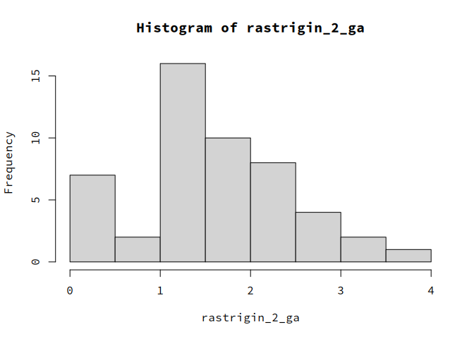

Wykres pudełkowy:

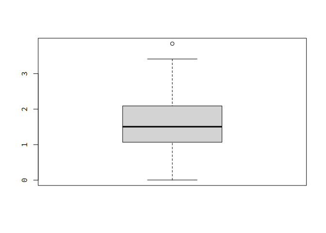

Podsumowanie:

    summary(rastrigin_2_ga)

    ##    Min. 1st Qu.  Median    Mean 3rd Qu.    Max. 
    ## 0.04623 1.00384 1.48930 1.59643 2.02819 4.24966

Średnia wartość:

    ## [1] 1.596433

### PRS

Histogram:

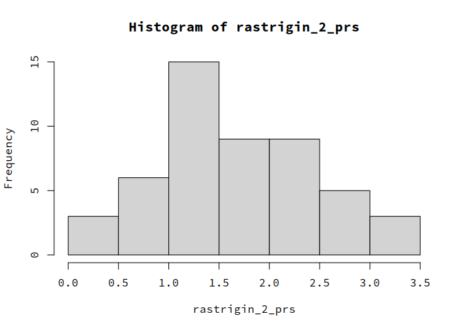

Wykres pudełkowy:

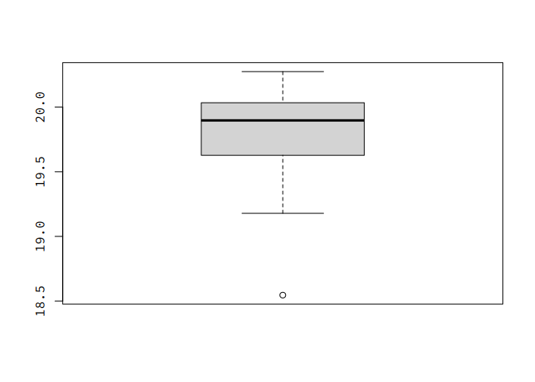

Podsumowanie:

    summary(rastrigin_2_prs)

    ##    Min. 1st Qu.  Median    Mean 3rd Qu.    Max. 
    ## 0.08653 1.11188 1.68572 1.76490 2.31209 4.67141

Średnia wartość:

    ## [1] 1.764895

### Test t-Studenta

    t.test(rastrigin_2_ga, rastrigin_2_prs)

    ## 
    ##  Welch Two Sample t-test
    ## 
    ## data:  rastrigin_2_ga and rastrigin_2_prs
    ## t = -0.82414, df = 97.708, p-value = 0.4119
    ## alternative hypothesis: true difference in means is not equal to 0
    ## 95 percent confidence interval:
    ##  -0.5741223  0.2371978
    ## sample estimates:
    ## mean of x mean of y 
    ##  1.596433  1.764895

## Dla dziesięciu wymiarów - Funkcja Ackley’a

    ackley_10 <- makeAckleyFunction(10)
    ackley_10_ga <- calculate_ga(ackley_10, 50)
    ackley_10_prs <- calculate_prs(ackley_10, 50)

### GA

Histogram:

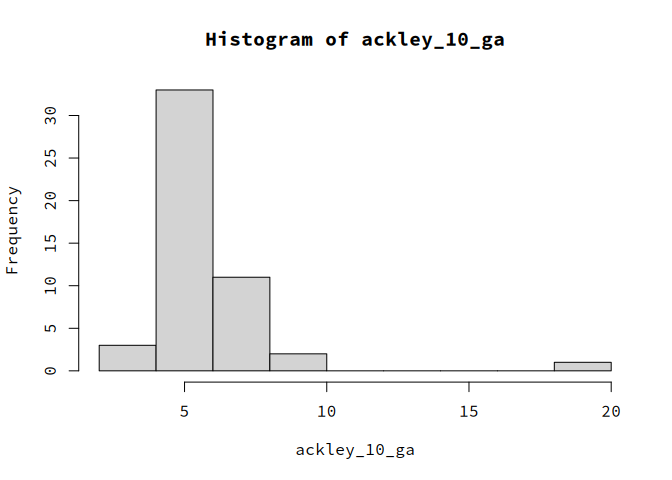

Wykres pudełkowy:

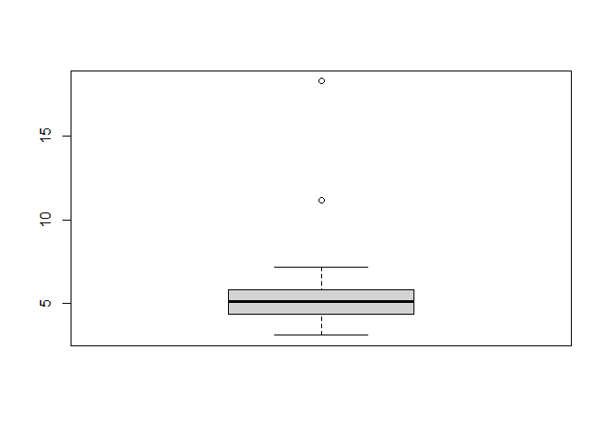

Podsumowanie:

    summary(ackley_10_ga)

    ##    Min. 1st Qu.  Median    Mean 3rd Qu.    Max. 
    ##   3.109   4.400   5.131   5.497   5.797  18.269

Średnia wartość:

    ## [1] 5.496621

### PRS

Histogram:

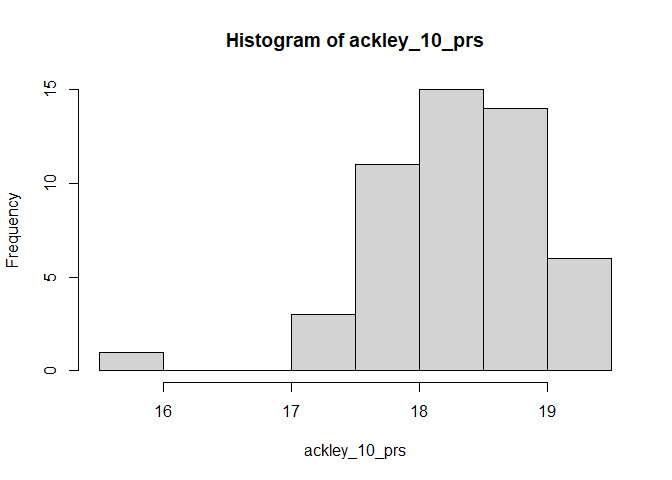

Wykres pudełkowy:

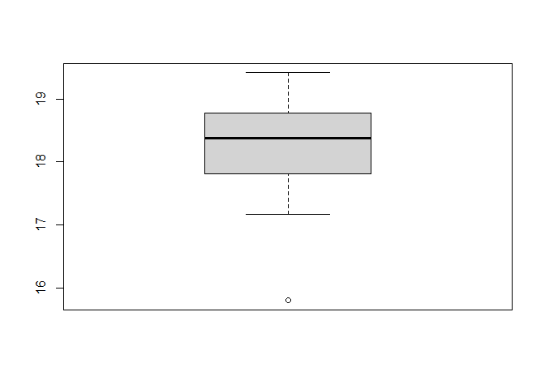

Podsumowanie:

    summary(ackley_10_prs)

    ##    Min. 1st Qu.  Median    Mean 3rd Qu.    Max. 
    ##   15.80   17.84   18.38   18.28   18.77   19.41

Średnia wartość:

    ## [1] 18.28207

### Test t-Studenta

    t.test(ackley_10_ga, ackley_10_prs)

    ## 
    ##  Welch Two Sample t-test
    ## 
    ## data:  ackley_10_ga and ackley_10_prs
    ## t = -39.433, df = 57.502, p-value < 2.2e-16
    ## alternative hypothesis: true difference in means is not equal to 0
    ## 95 percent confidence interval:
    ##  -13.43459 -12.13631
    ## sample estimates:
    ## mean of x mean of y 
    ##  5.496621 18.282072

## Dla dziesięciu wymiarów - Funkcja Rastringa

    rastrigin_10 <- makeRastriginFunction(10)
    rastrigin_10_ga <- calculate_ga(rastrigin_10, 50)
    rastrigin_10_prs <- calculate_prs(rastrigin_10, 50)

### GA

Histogram:

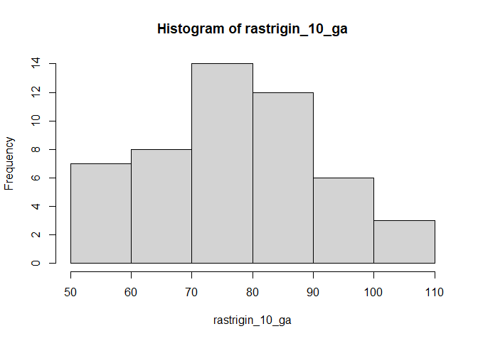

Wykres pudełkowy:

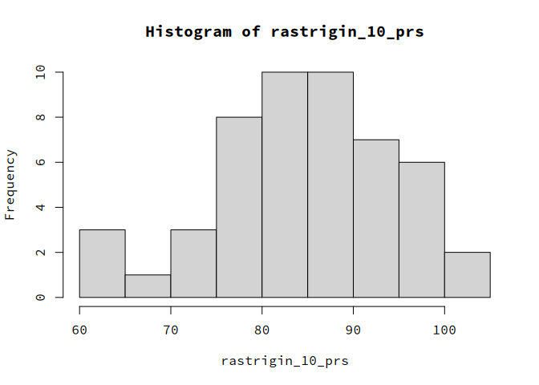

Podsumowanie:

    summary(rastrigin_10_ga)

    ##    Min. 1st Qu.  Median    Mean 3rd Qu.    Max. 
    ##   56.52   66.84   76.20   77.72   88.37  109.09

Średnia wartość:

    ## [1] 77.7172

### PRS

Histogram:

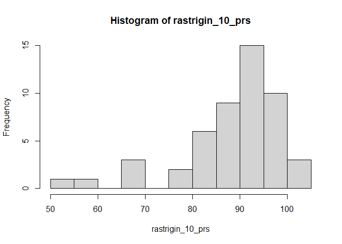

Wykres pudełkowy:

Podsumowanie:

    summary(rastrigin_10_prs)

    ##    Min. 1st Qu.  Median    Mean 3rd Qu.    Max. 
    ##   53.66   84.41   90.78   88.13   94.94  102.25

Średnia wartość:

    ## [1] 88.13317

### Test t-Studenta

    t.test(rastrigin_10_ga, rastrigin_10_prs)

    ## 
    ##  Welch Two Sample t-test
    ## 
    ## data:  rastrigin_10_ga and rastrigin_10_prs
    ## t = -4.3199, df = 94.128, p-value = 3.867e-05
    ## alternative hypothesis: true difference in means is not equal to 0
    ## 95 percent confidence interval:
    ##  -15.203341  -5.628602
    ## sample estimates:
    ## mean of x mean of y 
    ##  77.71720  88.13317

## Dla dwudziestu wymiarów - Funkcja Ackley’a

    ackley_20 <- makeAckleyFunction(20)
    ackley_20_ga <- calculate_ga(ackley_20, 50)
    ackley_20_prs <- calculate_prs(ackley_20, 50)

### GA

Histogram:

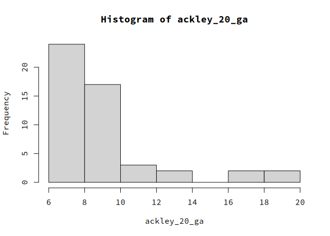

Wykres pudełkowy:

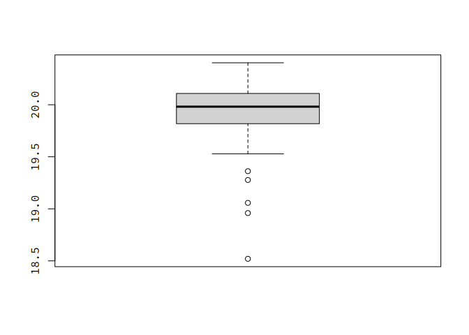

Podsumowanie:

    summary(ackley_20_ga)

    ##    Min. 1st Qu.  Median    Mean 3rd Qu.    Max. 
    ##   5.971   7.911   8.461   9.119   9.296  18.883

Średnia wartość:

    ## [1] 9.119355

### PRS

Histogram:

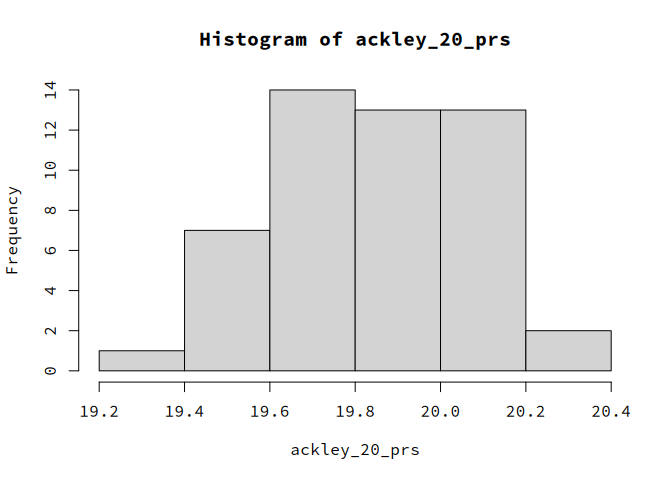

Wykres pudełkowy:

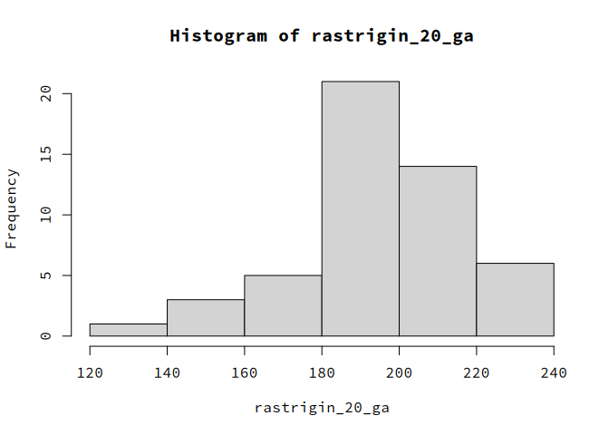

Podsumowanie:

    summary(ackley_20_prs)

    ##    Min. 1st Qu.  Median    Mean 3rd Qu.    Max. 
    ##   18.70   19.77   20.03   19.91   20.10   20.31

Średnia wartość:

    ## [1] 19.90562

### Test t-Studenta

    t.test(ackley_20_ga, ackley_20_prs)

    ## 
    ##  Welch Two Sample t-test
    ## 
    ## data:  ackley_20_ga and ackley_20_prs
    ## t = -27.935, df = 50.259, p-value < 2.2e-16
    ## alternative hypothesis: true difference in means is not equal to 0
    ## 95 percent confidence interval:
    ##  -11.56171 -10.01083
    ## sample estimates:
    ## mean of x mean of y 
    ##  9.119355 19.905623

## Dla dwudziestu wymiarów - Funkcja Rastringa

    rastrigin_20 <- makeRastriginFunction(20)
    rastrigin_20_ga <- calculate_ga(rastrigin_20, 50)
    rastrigin_20_prs <- calculate_prs(rastrigin_20, 50)

### GA

Histogram:

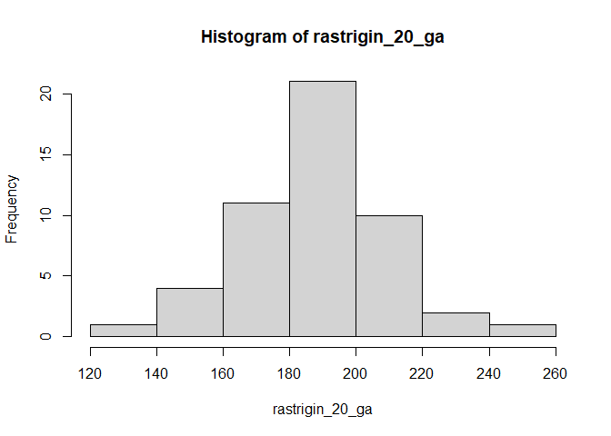

Wykres pudełkowy:

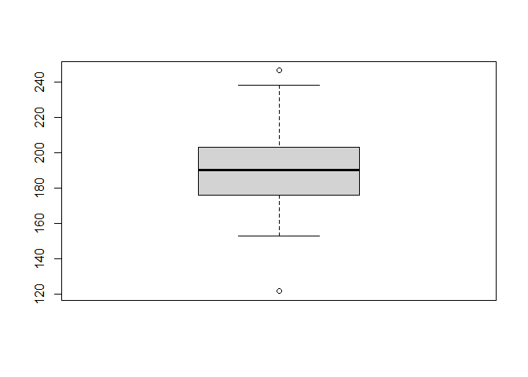

Podsumowanie:

    summary(rastrigin_20_ga)

    ##    Min. 1st Qu.  Median    Mean 3rd Qu.    Max. 
    ##   121.8   176.5   190.2   188.6   202.2   246.3

Średnia wartość:

    ## [1] 188.6283

### PRS

Histogram:

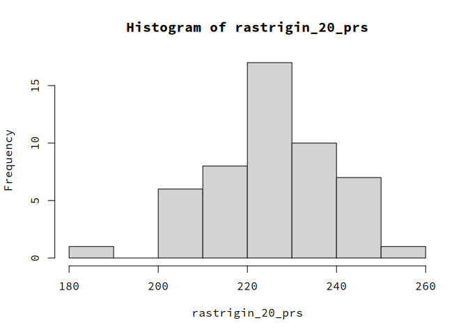

Wykres pudełkowy:

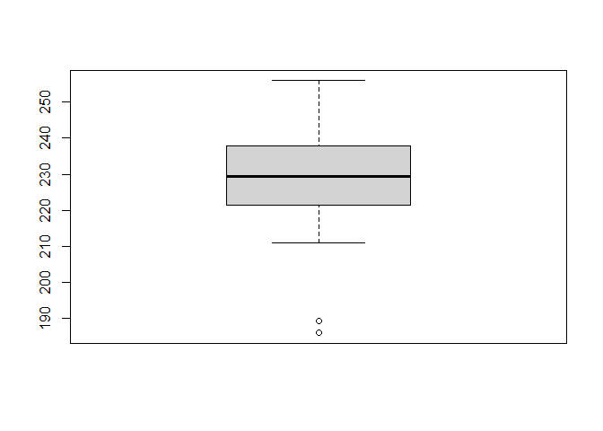

Podsumowanie:

    summary(rastrigin_20_prs)

    ##    Min. 1st Qu.  Median    Mean 3rd Qu.    Max. 
    ##   185.9   221.5   229.5   228.6   237.2   256.0

Średnia wartość:

    ## [1] 228.6232

### Test t-Studenta

    t.test(rastrigin_20_ga, rastrigin_20_prs)

    ## 
    ##  Welch Two Sample t-test
    ## 
    ## data:  rastrigin_20_ga and rastrigin_20_prs
    ## t = -10.942, df = 81.187, p-value < 2.2e-16
    ## alternative hypothesis: true difference in means is not equal to 0
    ## 95 percent confidence interval:
    ##  -47.26731 -32.72242
    ## sample estimates:
    ## mean of x mean of y 
    ##  188.6283  228.6232

# Analiza statystyczna otrzymanych wyników testu t-Studenta

Na początku dla przypomnienia zestawmy poniżej wyniki wszystkich sześciu
testów t-Studenta które wykonaliśmy. \#### Test t-Studenta dla wyników
algorytmu PRS i GA dla funkcji Ackley’a w dwóch wymiarach

    t.test(ackley_2_ga, ackley_2_prs)

    ## 
    ##  Welch Two Sample t-test
    ## 
    ## data:  ackley_2_ga and ackley_2_prs
    ## t = -15.241, df = 57.419, p-value < 2.2e-16
    ## alternative hypothesis: true difference in means is not equal to 0
    ## 95 percent confidence interval:
    ##  -3.790177 -2.910004
    ## sample estimates:
    ## mean of x mean of y 
    ## 0.4806562 3.8307469

#### Test t-Studenta dla wyników algorytmu PRS i GA dla funkcji Rastrigina w dwóch wymiarach

    t.test(rastrigin_2_ga, rastrigin_2_prs)

    ## 
    ##  Welch Two Sample t-test
    ## 
    ## data:  rastrigin_2_ga and rastrigin_2_prs
    ## t = -0.82414, df = 97.708, p-value = 0.4119
    ## alternative hypothesis: true difference in means is not equal to 0
    ## 95 percent confidence interval:
    ##  -0.5741223  0.2371978
    ## sample estimates:
    ## mean of x mean of y 
    ##  1.596433  1.764895

#### Test t-Studenta dla wyników algorytmu PRS i GA dla funkcji Ackley’a w dziesięciu wymiarach

    t.test(ackley_10_ga, ackley_10_prs)

    ## 
    ##  Welch Two Sample t-test
    ## 
    ## data:  ackley_10_ga and ackley_10_prs
    ## t = -39.433, df = 57.502, p-value < 2.2e-16
    ## alternative hypothesis: true difference in means is not equal to 0
    ## 95 percent confidence interval:
    ##  -13.43459 -12.13631
    ## sample estimates:
    ## mean of x mean of y 
    ##  5.496621 18.282072

#### Test t-Studenta dla wyników algorytmu PRS i GA dla funkcji Rastrigina w dziesięciu wymiarach

    t.test(rastrigin_10_ga, rastrigin_10_prs)

    ## 
    ##  Welch Two Sample t-test
    ## 
    ## data:  rastrigin_10_ga and rastrigin_10_prs
    ## t = -4.3199, df = 94.128, p-value = 3.867e-05
    ## alternative hypothesis: true difference in means is not equal to 0
    ## 95 percent confidence interval:
    ##  -15.203341  -5.628602
    ## sample estimates:
    ## mean of x mean of y 
    ##  77.71720  88.13317

#### Test t-Studenta dla wyników algorytmu PRS i GA dla funkcji Ackley’a w dwudziestu wymiarach

    t.test(ackley_20_ga, ackley_20_prs)

    ## 
    ##  Welch Two Sample t-test
    ## 
    ## data:  ackley_20_ga and ackley_20_prs
    ## t = -27.935, df = 50.259, p-value < 2.2e-16
    ## alternative hypothesis: true difference in means is not equal to 0
    ## 95 percent confidence interval:
    ##  -11.56171 -10.01083
    ## sample estimates:
    ## mean of x mean of y 
    ##  9.119355 19.905623

#### Test t-Studenta dla wyników algorytmu PRS i GA dla funkcji Rastrigina w dwudziestu wymiarach

    t.test(rastrigin_20_ga, rastrigin_20_prs)

    ## 
    ##  Welch Two Sample t-test
    ## 
    ## data:  rastrigin_20_ga and rastrigin_20_prs
    ## t = -10.942, df = 81.187, p-value < 2.2e-16
    ## alternative hypothesis: true difference in means is not equal to 0
    ## 95 percent confidence interval:
    ##  -47.26731 -32.72242
    ## sample estimates:
    ## mean of x mean of y 
    ##  188.6283  228.6232
